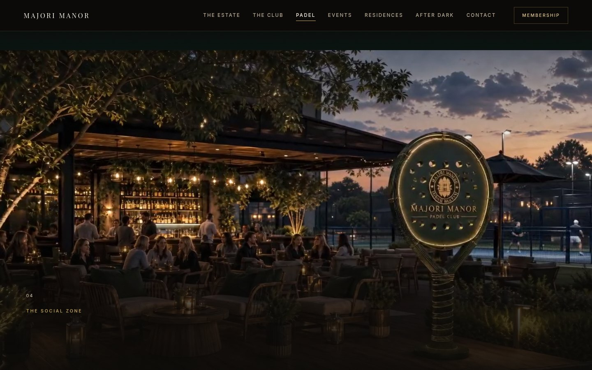
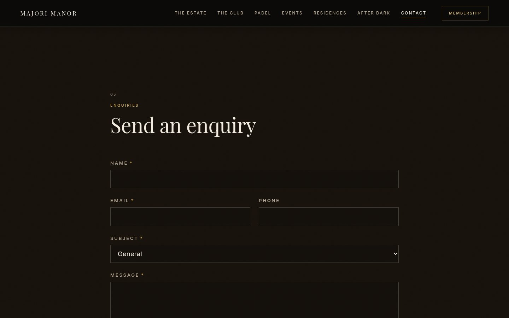
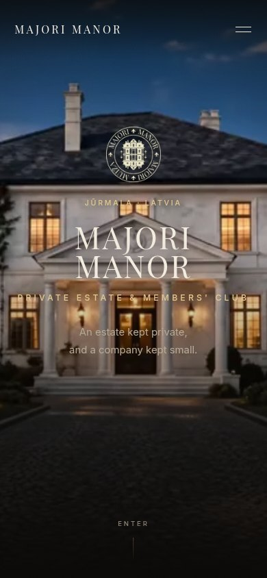

# Majori Manor — сайт

Сайт [Majori Manor](https://majorimanor.com) — усадьбы 1910 года в Юрмале (Латвия), которую восстанавливают как частный членский клуб. Одиннадцать страниц, смонтированных как один кинематографический скролл, две рабочие формы, карта — и ровно один сторонний запрос на весь сайт.

Чистый PHP на shared-хостинге. Без фреймворка, без сборки, без Composer, без базы данных, без CDN, без аналитики. Опубликовано с разрешения владельца — см. [Лицензия](#лицензия).

🇬🇧 [English version](README.md) · 📐 [Руководство разработчика](docs/DEVELOPER.md) (EN) · 📝 [Заметки по каждой странице](docs/) (EN)

---

## Скриншоты

| | |
|---|---|
|  |  |
|  |  |
|  |  |

Живой сайт: **[majorimanor.com](https://majorimanor.com)**

---

## Что внутри

| Часть | Как сделано |
|---|---|
| **Роутинг и i18n** | `routes.php` — единственный файл, где записан хоть один адрес. В шаблонах нет текста, в контент-файлах нет разметки, поэтому второй язык — это папка массивов, а не переписывание сайта. Английский живёт в корне; латышские слаги уже зарезервированы под `/lv/`. |
| **Дизайн-система** | Один стилевой файл с фиксированным порядком слоёв: токены → три цветовые температуры (`day` / `dusk` / `night`) → компоненты. Каждый компонент читает шесть переменных и никогда не называет цвет. **31 КБ gzip при бюджете 40 КБ.** |
| **Кинематографические страницы** | Девять scroll-driven сцен на `/`, почти чёрный фон, **51 короткая H.264-петля и ~700 WebP/JPEG-вариантов кадров**. Каждая внутренняя страница добавляет к «фильму» один CSS и один JS слой; GSAP + ScrollTrigger + Lenis, vendored. |
| **Формы** | Заявка на членство и запрос — одна реализация: HMAC-подписанный time-trap токен, honeypot, rate-limiter с двумя счётчиками (5 принятых / 20 любых POST с адреса в час), PHPMailer по SMTP, письма в HTML и plain-text. Обе работают с выключенным JavaScript. |
| **Приватность by construction** | Свои шрифты (variable woff2, subset до Latin Extended-A), Leaflet vendored, карта грузится по IntersectionObserver. Тайлы CARTO — единственный сторонний запрос на сайте: с одной страницы, после скролла. Именно это позволяет `/privacy` так и написать. |
| **SEO** | JSON-LD на каждой странице, canonical и Open Graph, генерируемый sitemap, `.htaccess` с HTTPS и www→apex редиректами, закрытые `app/` `content/` `templates/`, front controller. |
| **Медиа-пайплайн** | Один Python + Pillow + ffmpeg скрипт на страницу превращает концепт-рендеры клиента и сгенерированное видео во все кадры, постеры и петли, которые отдаёт сайт. Каждый промпт, стоящий за сгенерированным кадром, записан дословно в скрипте, который его собрал. |
| **Регрессия** | `snapshot_pages.sh` рендерит каждый маршрут на диск; `compare_pages.sh` сравнивает два снимка байт в байт. Изменение одной страницы доказуемо не сдвинуло остальные десять. |
| **Релиз** | `build_release.sh` собирает дерево, переписывает продакшн-конфиг (DEV выкл., свежий `FORM_SECRET`, SMTP переносится нетронутым), пересобирает sitemap под apex-домен и упаковывает zip для файлового менеджера DirectAdmin. |

---

## Стек и навыки

| Область | Использовано |
|---|---|
| **Backend** | PHP 8 (`strict_types`, без фреймворка), front controller, PHPMailer 6.9, Apache/LiteSpeed `.htaccess` |
| **Frontend** | HTML5, CSS custom properties и дизайн-токены, vanilla JavaScript (ES2020, `IntersectionObserver`, без jQuery), GSAP 3.15 + ScrollTrigger, Lenis, Leaflet 1.9.4 |
| **Медиа** | Python 3.12, Pillow, NumPy, ffmpeg (H.264-петли, постер-кадры), responsive-наборы WebP/JPEG, `pyftsubset` для subset'а шрифтов, генеративное видео и стиллы (Seedance 2.5, GPT Image) из рендеров клиента |
| **Инструменты** | Bash, Node + puppeteer-core (замер контраста настоящими wheel-событиями), Chrome/Playwright для review-скриншотов, git |
| **Ops** | DirectAdmin shared-хостинг, DNS, SSL, почтовые ящики и SMTP, staging/production конфиги, сборка релизов |
| **Качество** | WCAG-контраст измерен, а не оценён на глаз; byte-identity регрессия; gzip-бюджет на каждый файл; CLS 0 проверен на throttled-соединении; каждая страница работает без JavaScript |

В цифрах: **~46 000 строк** — 3,9 k PHP-приложение, 7,6 k шаблоны, 8,5 k контент, 11,7 k CSS, 3,9 k JS, 10 k инструменты — 38 компонентов, 14 шаблонов страниц, 11 публичных страниц.

---

## Как обслуживается запрос

```
GET /the-estate
   → .htaccess: не файл, не директория            → index.php
   → resolve_request(): сегмент 0 — не известный не-дефолтный язык,
     значит это slug, а язык — DEFAULT_LANG ('en')
   → routes.php: 'the-estate' → page id 'estate'
   → $t = content/en/common.php   $c = content/en/estate.php
   → templates/pages/estate.php рендерится в буфер
   → templates/layout.php оборачивает его
```

Адрес, который ничему не соответствует, получает `404` тем же путём. Ничто не обходит layout.

Три правила, на которых всё держится:

- **`routes.php` — единственное место, где записан адрес.** Шаблоны вызывают `url('estate')`; ни один URL не захардкожен.
- **В `templates/` нет человекочитаемого текста.** Каждая строка приходит из `content/<lang>/` — фраза в шаблоне это фраза, которую нельзя перевести.
- **В `content/` нет разметки.** Контент-файл делает `return` массива и больше ничего.

---

## Запуск локально

```bash
git clone git@github.com:dovlet808/majorimanor-site.git
cd majorimanor-site
cp private/config.example.php private/config.php   # поставить DEV в true
php -S localhost:8000 -t public_html
```

Открыть <http://localhost:8000>. Нужен только PHP 8; устанавливать нечего.

Без `config.php` каждый запрос отвечает `500` с текстовым напоминанием скопировать образец. Под встроенным сервером PHP `.htaccess` игнорируется: редиректы HTTPS и www→apex не срабатывают, а `app/`, `content/`, `templates/` доступны — на Apache/LiteSpeed каждая из этих директорий закрыта полностью.

При `DEV = true` есть две дополнительные страницы: `/styleguide` (все токены, типографическая шкала, три температуры, покрытие Latin Extended-A) и `/components`. В продакшене `index.php` отбрасывает их до загрузки чего-либо, и они отвечают настоящим 404.

---

## Структура проекта

```
majorimanor-site/
├── private/                    выше webroot — никогда не отдаётся
│   ├── config.example.php       в репозитории; единственный файл с настройками
│   └── logs/                    лог ошибок PHP, лог форм, состояние rate-limiter'а
├── public_html/                webroot DirectAdmin
│   ├── .htaccess                https, www→apex, без листингов, front controller
│   ├── index.php                единственная точка входа
│   ├── app/                     bootstrap, роутинг, хелперы, forms/, vendor/PHPMailer
│   ├── content/en/              один массив на страницу — текст и ничего больше
│   ├── templates/               layout, partials, 14 страниц, 38 компонентов — разметка без текста
│   └── assets/
│       ├── css/                 main.css (дизайн-система) + по файлу на страницу-«фильм»
│       ├── js/                  main.js + по файлу на страницу; vendor/ (GSAP, Lenis), leaflet/
│       ├── fonts/               два variable woff2, свои
│       ├── img/                 responsive-кадры, постеры, бренд
│       └── video/               51 H.264-петля
├── tools/
│   ├── photos/                  build_<page>_media.py — медиа-пайплайн, по скрипту на страницу
│   ├── motion/                  build_sequences.sh — кодирование видео
│   ├── brand/                   герб и монограмма, исправление caron
│   ├── snapshot_pages.sh        рендер каждого маршрута на диск
│   ├── compare_pages.sh         побайтовый diff двух снимков
│   ├── measure_contrast.js      худший контраст каждого текстового элемента на странице
│   ├── build_sitemap.php        + verify_sitemap.php
│   └── mail_preview.php         рендер обоих писем без отправки
├── deploy/
│   ├── build_release.sh         продакшн-zip одной командой
│   └── build_release_parts.sh   то же по частям — под лимит загрузки файлового менеджера
└── docs/
    ├── DEVELOPER.md             руководство мейнтейнера: дизайн-система, хелперы, латышский, деплой
    ├── MAIN_PAGE.md             отчёт о главной: аудит ассетов, промпты, бюджет загрузки
    ├── THE_ESTATE.md … TERMS.md по отчёту на страницу: что решено и почему
    └── ASSET_MANIFEST.md        каждый визуальный слот и чем он заполнен
```

Чего нет в репозитории: исходники под `media_src/` (концепт-рендеры клиента, оригиналы съёмки, файлы логотипа — около 600 МБ), собранные релизные zip-архивы и настоящий `config.php`. См. `.gitignore`.

---

## Как это делалось

Соло-проект, август–сентябрь 2026: от русскоязычного ТЗ и концепт-брошюры до живого сайта. Всё на мне: ТЗ с владельцем, архитектура, дизайн-система, одиннадцать страниц и две формы, медиа-пайплайн, хостинг, DNS и почта на DirectAdmin-аккаунте клиента, проверка в браузере на каждом шаге (десктоп и телефон) и каждый релиз. Каждое важное решение — что сайт может и не может утверждать о ещё не открытом доме, почему атрибуция карты переехала, почему бюджет стилей вырос с 30 до 40 КБ — записано в `docs/`.

---

## Заметки по безопасности

- `private/` лежит **рядом** с webroot, а не внутри; `bootstrap.php` находит его на уровень выше. Пароль почты никогда не лежит в директории, которую отдаёт Apache.
- `private/config.php` игнорируется git и переписывается `build_release.sh` для продакшена — SMTP-настройки переносятся, нигде не выводятся и не сохраняются.
- Каждый вывод проходит через `e()` (`htmlspecialchars`, `ENT_QUOTES`, UTF-8).
- Формы: time-trap токен, подписанный HMAC-SHA-256 под `FORM_SECRET`; honeypot; rate-limit по адресу, где ключ — усечённый HMAC адреса, а не сам адрес; заголовки письма собирает PHPMailer, так что перевод строки в поле «имя» не станет заголовком.
- `app/`, `content/` и `templates/` несут собственный `.htaccess`, который закрывает всё; проверка после деплоя — `/app/routes.php` отвечает 403.
- Ни одного стороннего скрипта в разметке; единственный внешний запрос (тайлы карты) делается только когда читатель доскроллил до карты.

---

## Лицензия

© Majori Manor. Исходный код опубликован с разрешения владельца для ознакомления с работой; он **не** лицензирован для повторного использования. Код, тексты, бренд-ассеты, изображения и видео остаются собственностью клиента.

Vendored-библиотеки сохраняют свои лицензии: GSAP (Standard License), Lenis (MIT), Leaflet (BSD-2-Clause), PHPMailer (LGPL-2.1).
